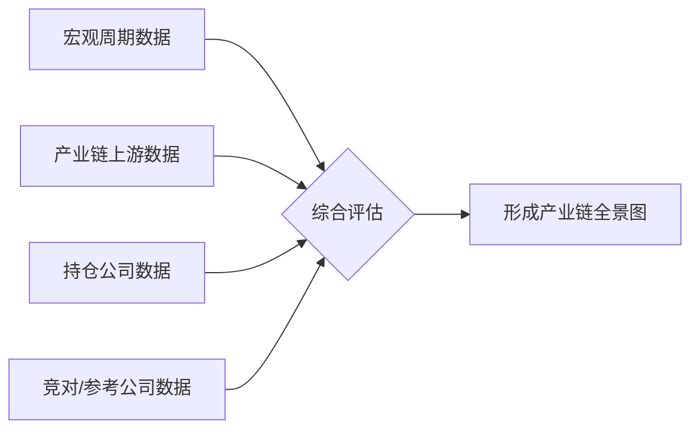

# 半导体投资分析框架（聚焦 SoC 赛道）

## 核心原则
- **投资哲学**: 寻找产业链中具备定价权、产品竞争力的公司，而非单纯追逐风口
- **方法论**: 产业链交叉验证，多维度信号相互印证
- **核心假设**: 端侧AI（AI眼镜、机器人、智能座舱）是下一波增长驱动力

---

## 一、宏观经济与行业周期监测

### 1.1 消费电子周期
| 指标 | 数据来源 | 监测频率 | 对持仓的影响 |
|---|---|---|---|
| 全球手机出货量增速 | IDC/Counterpoint | 季度 | 影响终端客户拉货意愿 |
| 中国手机出货量 | 信通院 | 月度 | 上游芯片订单的先行指标 |
| PC出货量 | IDC/Gartner | 季度 | AI PC对瑞芯微的影响 |
| TWS耳机出货量 | Counterpoint | 季度 | 恒玄等协处理器厂商参考 |
| **关键信号**: 下游品牌厂"主动去库存"→上游芯片订单减少（参考恒玄2026Q1案例）|

### 1.2 半导体周期
| 指标 | 数据来源 | 监测频率 | 影响 |
|---|---|---|---|
| 全球半导体销售额 | SIA/WSTS | 月度 | 行业景气度基准 |
| 芯片交货周期 | Susquehanna | 月度 | 供需紧张程度 |
| 晶圆厂产能利用率 | 台积电/中芯国际法说 | 季度 | SoC供应端约束 |
| **SoC设计公司库存周转天数** | 各公司财报 | 季度 | 是否存在库存积压 |

### 1.3 AI产业跟踪
| 关注点 | 关键信号 | 影响逻辑 |
|---|---|---|
| 大模型成本趋势 | API价格下降速度 | 算力成本↓ → 边缘AI门槛↓ |
| AI终端落地节奏 | AI眼镜/机器人出货量 | 直接决定SoC需求 |
| 上游AI投资热度 | 资本开支/融资情况 | 达利欧泡沫论的本质是上游过热 |

---

## 二、产业链各环节数据采集

### 2.1 上游：存储（对全志影响最直接）

#### 关键指标
| 指标 | 关注原因 | 数据来源 | 近期状态 |
|---|---|---|---|
| **LPDDR价格** | 全志原材料成本（直接影响毛利率） | DRAMeXchange | 消费级存储涨势趋缓 |
| **HBM供需** | AI专用存储需求（结构性分化） | TrendForce | 仍旺盛，三星/SK扩产 |
| **美光/三星/SK海力士股价** | 市场对存储周期的预期 | 财报/股价 | 近期下跌（消费级拖累） |
| **存储厂商毛利率指引** | 细分市场的结构性信号 | 财报电话会 | 美光30-33%低于预期 |

#### 核心判断逻辑
```
存储温和涨价 → 全志可控成本（可转嫁）
存储暴跌     → 不可控风险（存货跌价、客户延迟下单）
存储涨势趋缓 → 全志成本端边际改善，毛利率利好
```

### 2.2 上游：封测

#### 关键指标
| 指标 | 关注原因 |
|---|---|
| **台积电CoWoS产能排期** | 先进封装供不应求的信号 |
| **封测厂营收增速** | 全志下游需求真实存在的交叉验证 |
| **封测价格趋势** | SoC公司成本端 |

#### 核心判断
封测需求爆发 → 下游客户在为新品积极拉货 → 全志/瑞芯微需求真实存在

### 2.3 上游：晶圆代工
| 指标 | 关注原因 |
|---|---|
| **台积电/中芯国际产能利用率** | SoC供应端约束 |
| **成熟制程价格** | 全志主要制程（28nm及以下） |
| **硅片（硅晶圆）价格** | 代工成本传导 |

### 2.4 中游：SoC设计公司（核心持仓）

#### 全志科技（Allwinner Technology）关键跟踪指标
| 维度 | 指标 | 近期数据/状态 |
|---|---|---|
| **财务** | 毛利率 | Q1 2026: 40.17%（大幅提升） |
| | 营收/净利润增速 | 高增长 |
| | 存货周转天数 | 需要持续跟踪 |
| **产品** | AI眼镜芯片出货量 | V821/V881百万颗级别 |
| | 扫地机芯片 | MR536大规模出货 |
| | 车载前装 | 智能车载项目交付 |
| **技术** | 单芯片主控方案 | 相对恒玄协处理器模式更灵活 |
| | 产品是否具备提价能力 | Q1已验证可转嫁成本 |

#### 瑞芯微（Rockchip）关键跟踪指标
| 维度 | 指标 | 近期数据/状态 |
|---|---|---|
| **财务** | PE（TTM） | ~70倍（合理偏高，非泡沫） |
| | 减持情况 | 黄旭减持1.53%（非核心层） |
| | 减持方式 | 大宗交易，5%折价（正常区间） |
| **业务** | AI PC 相关 | 与英伟达合作生产AIPC |
| | 产品定位 | 与全志互补的SoC厂商 |

#### 恒玄科技（BES，作为竞争/参考标的）
| 维度 | 指标 | 近期数据/状态 |
|---|---|---|
| **财务** | Q1净利同比 | -53.26% |
| | PE（TTM） | ~102倍（高估值风险） |
| | 存货 | 4.4亿元（面临跌价风险） |
| **核心问题** | 商业模式 | 协处理器，依赖大客户方案 |
| | 下游结构 | 高度依赖手机大厂，去库存冲击全局 |

---

## 三、标准化投资决策流程

### 步骤1：定期数据采集（每周/每月）


**每周例行检查清单**:
- [ ] 存储相关新闻（美光、三星、SK海力士）
- [ ] 封测/代工行业新闻
- [ ] 端侧AI终端产品发布
- [ ] 主要竞争SoC公司动态

**每月例行检查清单**:
- [ ] 半导体销售额数据（SIA）
- [ ] 手机/PC出货量数据
- [ ] 目标公司公告（减持、股权变动）

**每季度例行检查清单**:
- [ ] 全志科技/瑞芯微财报分析
- [ ] 恒玄/晶晨/圣邦等对标公司财报
- [ ] 台积电/中芯国际法说会纪要
- [ ] 毛利率趋势分析
- [ ] 存货/应收账款分析

### 步骤2：信号强度评估

| 信号类型 | 强度 | 举例 |
|---|---|---|
| **产业链交叉验证** | ★★★★★ | 封测需求↑ + 全志出货↑ = 强需求信号 |
| **成本端变化** | ★★★★ | 存储价格↓ → 直接利好毛利率 |
| **客户/竞争对手财报** | ★★★★ | 恒玄业绩↓ ≠ 行业问题，可能是商业模式问题 |
| **大股东减持** | ★★~★★★★ | 财务投资者减持(★) vs 核心层集体减持(★★★★) |
| **媒体报道/新闻** | ★★ | 需要交叉验证 |

### 步骤3：关键预警清单

**需要警惕的信号**:
- [ ] 全志/瑞芯微毛利率连续两个季度下滑
- [ ] 核心经营层集体减持（参考2021全志教训）
- [ ] 下游客户库存持续高企
- [ ] 高管离职/技术路线重大变更
- [ ] 存货大幅增长 + 应收账款恶化

**不必过度解读的信号**:
- [ ] 行业偶发负面新闻（需区分行业共性问题 vs 公司个体问题）
- [ ] 财务投资者小额减持
- [ ] 短期上游价格波动（核心看公司自身成长逻辑）
- [ ] 竞对短期业绩波动

---

## 四、核心投资逻辑框架图

```
┌─────────────────────────────────────────────────────┐
│              长期信仰：端侧AI爆发                       │
│    AI眼镜 → 机器人 → 智能座舱 → 更多IoT终端             │
└─────────────────────────────────────────────────────┘
                          │
                          ▼
┌─────────────────────────────────────────────────────┐
│              持仓公司筛选标准                          │
│  1. 产品有定价权（能转嫁成本 = 高/稳毛利率）            │
│  2. 商业模式：主控SoC > 协处理器                      │
│  3. 客户结构分散 > 高度集中                           │
│  4. 有实际产品出货（不是纯概念）                       │
└─────────────────────────────────────────────────────┘
                          │
                          ▼
┌─────────────────────────────────────────────────────┐
│              产业链交叉验证闭环                        │
│                                                      │
│  上游涨价 → 全志成本↑ → 全志提价 → 验证定价权         │
│  上游降价 → 全志成本↓ → 毛利率维持/提升 → 利好       │
│  封测需求↑ → 下游客户拉货↑ → 全志订单↑ → 验证需求    │
│  存储需求↓ → 区分：消费级(影响全志成本) vs HBM(无关)   │
└─────────────────────────────────────────────────────┘
                          │
                          ▼
┌─────────────────────────────────────────────────────┐
│              决策锚点（按重要性排序）                    │
│  1. Q2/Q3季报（业绩是压舱石）                        │
│  2. 下游AI终端实际销量（验证真成长 vs 备货脉冲）        │
│  3. 机构盈利预测上修                                  │
│  4. 毛利率趋势（40%能否站稳/提升）                    │
└─────────────────────────────────────────────────────┘
```

---

## 五、定期复盘模板（建议每季度使用）

### 季度投资检查表
**日期**: ________   **标的**: 全志科技 / 瑞芯微

**1. 上游环境变化**
- [ ] 存储价格趋势：上涨 / 下跌 / 持平
- [ ] 封测产能：紧张 / 宽松
- [ ] 代工产能利用率：满产 / 有空余
- [ ] 核心判断：利好 / 利空 / 中性

**2. 公司基本面**
- [ ] 毛利率变化：____%（上季度____%）
- [ ] 营收增速：____%
- [ ] 净利润增速：____%
- [ ] 存货水平：高 / 正常 / 低
- [ ] 新产品出货：有 / 无（_______）
- [ ] 核心判断：超预期 / 符合预期 / 低于预期

**3. 市场信号**
- [ ] 主要股东增减持：有（______） / 无
- [ ] 管理层态度：积极 / 中性 / 消极
- [ ] 研报评级变化：上调 / 维持 / 下调
- [ ] 竞对财报启示：正面 / 负面

**4. 整体评估**
```
综合评分：___/10
继续持有 / 加仓 / 减仓 / 清仓
理由：______________________________________
下一季度关键关注点：______________________________________
```

---

## 六、补充：关于"上游 vs 下游"的思考

### 你的核心矛盾
```
上游（设备/代工/存储） → 已火爆，利润看得见
下游（SoC/终端）      → 在等待端侧AI爆发，时间不确定
```

### 框架建议
- **上游投资**特点：确定性高但估值可能已反映，周期性强
- **下游投资**特点：爆发前夜埋伏，弹性大但需耐心
- **平衡策略**：可以少量配置体现上游确定性的标的（如封测龙头），保留核心仓位下注端侧AI爆发

---

*框架版本: v1.0 | 生成日期: 2026-06-07*
*基于用户对全志科技和瑞芯微的深度跟踪分析提炼*
